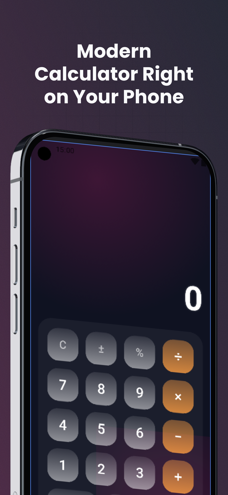
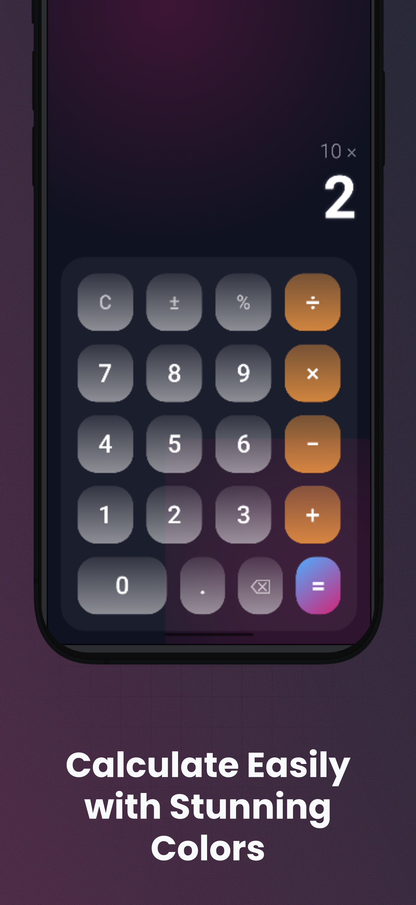
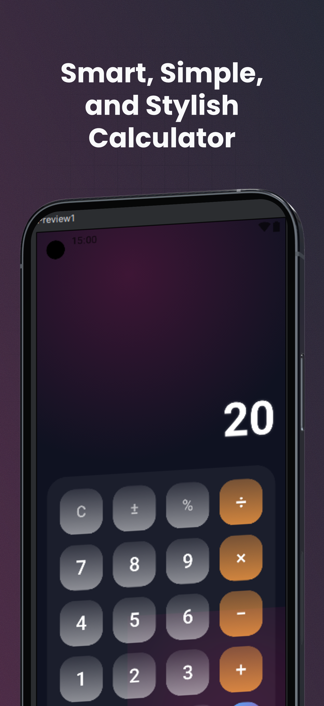

# 📱 Modern Calculator App 

A modern, elegant, and responsive calculator built entirely with **Jetpack Compose** — featuring glass-morphism UI, neon glow effects, smooth animations, and complete calculation logic.

---

## ✨ Overview

**Modern Calculator App** combines premium UI design with high performance and simplicity.  
It delivers a visually impressive experience through:

- Glass-Morphism interface  
- Neon blue & pink glow effects  
- Blurred transparent layers  
- Smooth and fast user interaction  
- Clean and minimalist layout

The app focuses on premium aesthetics while keeping the calculator fully functional and extremely responsive.

---

## 🎨 Features

### 🌟 UI & Design
- Stunning **glass-style buttons** with transparency & shadows  
- **Neon glowing background** (Blue / Pink)  
- Radial & linear **gradient effects**  
- Squircle rounded buttons  
- Fully responsive layout for all screen sizes  
- Premium interaction experience (no ripple, smooth touch feedback)

---

### ⚙️ Functionality
Includes all essential calculator operations:

`+` `−` `×` `÷` `%` `±` `.` `=` `C` `⌫`

- Real-time expression building  
- Error handling for invalid inputs  
- Smart output formatting  
- Prevents double operators & invalid sequences  

---

## 🚀 Performance

- 100% **Jetpack Compose**, no XML  
- Optimized state management using `remember` + `mutableStateOf`  
- Minimal recomposition for high performance  
- Lightweight and clean architecture  

---

## 🧠 Technologies Used

| Category      | Tech |
|---------------|------|
| Language      | Kotlin |
| UI            | Jetpack Compose |
| Theme         | Material 3 |
| Architecture  | Stateless composables + simple state holder |
| Styling       | Gradients, blur, neon glow |
| Tools         | Android Studio Iguana / Jellyfish |

---

## 🖼️ Screenshots

  
  
  

---

## ❤️ Author

**Ahmed Mohamed**  
Android Developer — Kotlin | Jetpack Compose | UI/UX  

If you'd like to collaborate on stylish UI apps or need a premium interface built with Compose, feel free to reach out!

---
